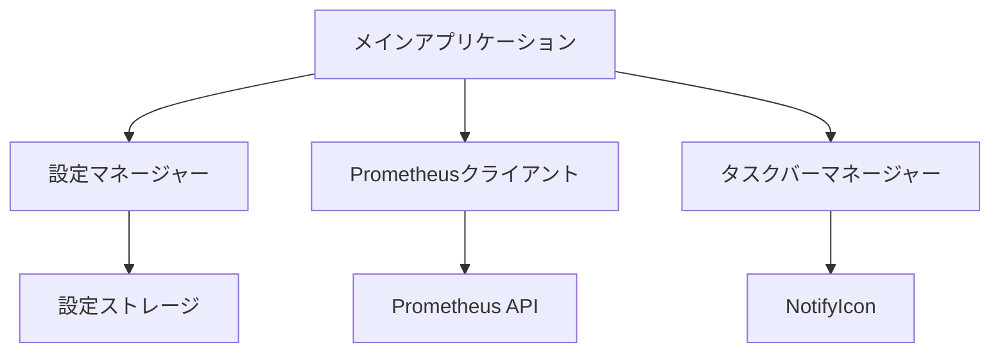
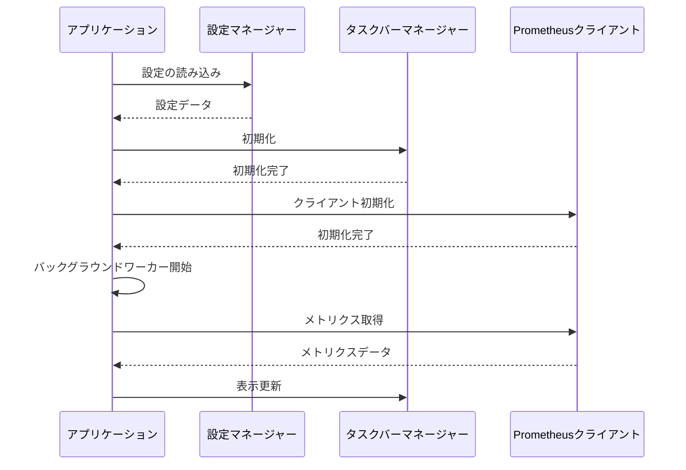
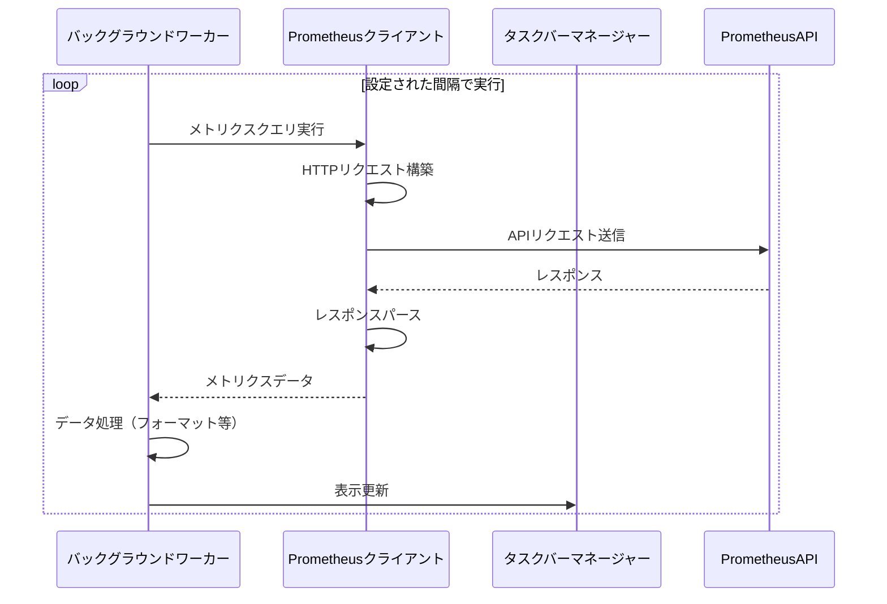
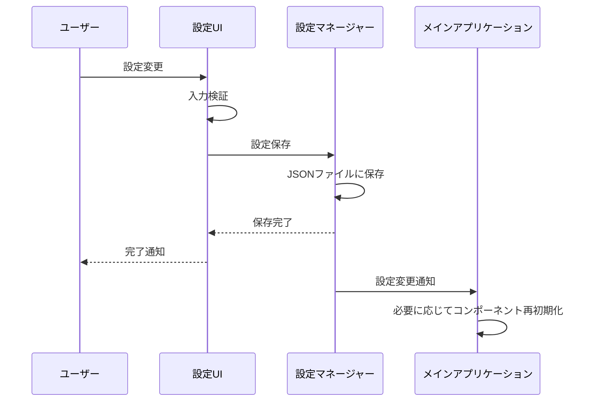

# Prometheus Taskbar アプリケーション詳細計画

## 概要

このアプリケーションは、Prometheusからメトリクスデータを取得し、Windowsタスクバーに表示するためのツールです。.NET (C#) と WPF を使用して構築します。

## アーキテクチャ



## コンポーネント詳細

### 1. メインアプリケーション (MainApp)
- アプリケーションのエントリーポイント
- 他のコンポーネントの初期化と調整
- バックグラウンドワーカーの管理（メトリクス取得のスケジューリング）

### 2. 設定マネージャー (ConfigManager)
- ユーザー設定の読み込みと保存
- 設定変更の検知と適用

### 3. Prometheusクライアント (PrometheusClient)
- HTTP経由でPrometheusエンドポイントに接続
- クエリの構築と実行
- レスポンスのパース

### 4. タスクバーマネージャー (TaskbarManager)
- NotifyIconの管理
- タスクバー表示の更新
- クリックイベントの処理

## UI設計

### メイン設定ウィンドウ

```
+-----------------------------------------------+
|  Prometheus Taskbar 設定                 _ □ X |
+-----------------------------------------------+
| [タブ: 接続] [タブ: メトリクス] [タブ: 表示設定]  |
+-----------------------------------------------+
|                                               |
|  Prometheusエンドポイント:                     |
|  [                                      ] [テスト] |
|                                               |
|  接続タイムアウト: [    ] 秒                   |
|                                               |
|  認証:                                        |
|  ( ) なし                                     |
|  ( ) Basic認証                                |
|    ユーザー名: [                          ]   |
|    パスワード: [                          ]   |
|                                               |
|                                               |
|                [キャンセル]    [保存]         |
+-----------------------------------------------+
```

### メトリクスタブ

```
+-----------------------------------------------+
|  Prometheus Taskbar 設定                 _ □ X |
+-----------------------------------------------+
| [タブ: 接続] [タブ: メトリクス] [タブ: 表示設定]  |
+-----------------------------------------------+
|                                               |
|  表示するメトリクス:                           |
|  +-----------------------------------+        |
|  | メトリクス名 | ラベル | 表示名    |        |
|  +-----------------------------------+        |
|  | bme_280_... | temp=1 | 温度      |  [編集] |
|  |             |        |           |  [削除] |
|  |             |        |           |        |
|  +-----------------------------------+        |
|                                               |
|  [メトリクス追加]                              |
|                                               |
|  更新間隔: [    ] 秒                          |
|                                               |
|                [キャンセル]    [保存]         |
+-----------------------------------------------+
```

### 表示設定タブ

```
+-----------------------------------------------+
|  Prometheus Taskbar 設定                 _ □ X |
+-----------------------------------------------+
| [タブ: 接続] [タブ: メトリクス] [タブ: 表示設定]  |
+-----------------------------------------------+
|                                               |
|  表示形式:                                    |
|  ( ) 数値のみ                                 |
|  (•) 名前: 数値                               |
|  ( ) カスタム形式: [                      ]   |
|                                               |
|  小数点以下桁数: [  2  ]                      |
|                                               |
|  単位を表示: [✓]                              |
|                                               |
|  アラート設定:                                |
|  [ ] 閾値を超えたら色を変える                  |
|      閾値: [      ]  色: [    ]               |
|                                               |
|  [ ] スタートアップ時に自動起動                |
|                                               |
|                [キャンセル]    [保存]         |
+-----------------------------------------------+
```

### メトリクス追加/編集ダイアログ

```
+-----------------------------------------------+
|  メトリクス設定                         _ □ X |
+-----------------------------------------------+
|                                               |
|  メトリクス名:                                |
|  [                                      ]     |
|                                               |
|  PromQLクエリ:                                |
|  [                                      ]     |
|                                               |
|  表示名:                                      |
|  [                                      ]     |
|                                               |
|  ラベル:                                      |
|  +----------------------------+               |
|  | キー     | 値             |               |
|  +----------------------------+               |
|  | instance | localhost:9090 |        [削除] |
|  |          |                |               |
|  +----------------------------+               |
|                                               |
|  [ラベル追加]                                 |
|                                               |
|  単位: [                 ]                    |
|                                               |
|            [キャンセル]    [保存]             |
+-----------------------------------------------+
```

### タスクバー表示

```
+------------------+
| 温度: 23.5°C     |
+------------------+
```

右クリックメニュー:
```
+------------------+
| 更新             |
| 設定を開く       |
| 終了             |
+------------------+
```

## アプリケーションフロー

### 起動シーケンス



### メトリクス更新フロー



### 設定変更フロー



## データモデル

### 設定モデル

```csharp
public class AppSettings
{
    public ConnectionSettings Connection { get; set; }
    public List<MetricSettings> Metrics { get; set; }
    public DisplaySettings Display { get; set; }
}

public class ConnectionSettings
{
    public string EndpointUrl { get; set; }
    public int TimeoutSeconds { get; set; }
    public AuthSettings Authentication { get; set; }
}

public class AuthSettings
{
    public AuthType Type { get; set; }
    public string Username { get; set; }
    public string Password { get; set; }
}

public class MetricSettings
{
    public string MetricName { get; set; }
    public string PromQlQuery { get; set; }
    public string DisplayName { get; set; }
    public Dictionary<string, string> Labels { get; set; }
    public string Unit { get; set; }
}

public class DisplaySettings
{
    public DisplayFormat Format { get; set; }
    public string CustomFormat { get; set; }
    public int DecimalPlaces { get; set; }
    public bool ShowUnit { get; set; }
    public AlertSettings Alert { get; set; }
    public bool AutoStartWithWindows { get; set; }
}

public class AlertSettings
{
    public bool Enabled { get; set; }
    public double Threshold { get; set; }
    public string Color { get; set; }
}

public enum AuthType
{
    None,
    Basic
}

public enum DisplayFormat
{
    ValueOnly,
    NameAndValue,
    Custom
}
```

## 技術的な考慮事項

### 1. パフォーマンス最適化
- バックグラウンドでの軽量な実行
- メモリ使用量の最小化
- 効率的なHTTPリクエスト（キャッシュ、圧縮など）

### 2. エラーハンドリング
- ネットワーク接続エラー
- Prometheusサーバーの応答エラー
- 設定ファイルの破損

### 3. セキュリティ
- 認証情報の安全な保存（暗号化）
- HTTPS接続のサポート

### 4. ユーザビリティ
- 直感的なUI
- リアルタイムのフィードバック
- ツールチップとヘルプテキスト

## 開発ロードマップ

1. **フェーズ1: 基本機能**
   - プロジェクト設定
   - 基本的なタスクバー統合
   - シンプルなPrometheus接続

2. **フェーズ2: 設定UI**
   - 設定ウィンドウの実装
   - 設定の保存と読み込み

3. **フェーズ3: 拡張機能**
   - 複数メトリクスのサポート
   - カスタム表示形式
   - アラート機能

4. **フェーズ4: 最適化とテスト**
   - パフォーマンス最適化
   - エラーハンドリングの改善
   - ユーザーテスト

## 必要なNuGetパッケージ

- `Hardcodet.NotifyIcon.Wpf` - タスクバーアイコン管理
- `Newtonsoft.Json` - JSON処理
- `RestSharp` - HTTPクライアント
- `Microsoft.Extensions.Configuration` - 設定管理
- `Microsoft.Extensions.DependencyInjection` - DIコンテナ
- `prometheus-net` - Prometheusクライアント（オプション）

## 開発環境

- Visual Studio 2022
- .NET 6.0以上
- Windows 10/11
